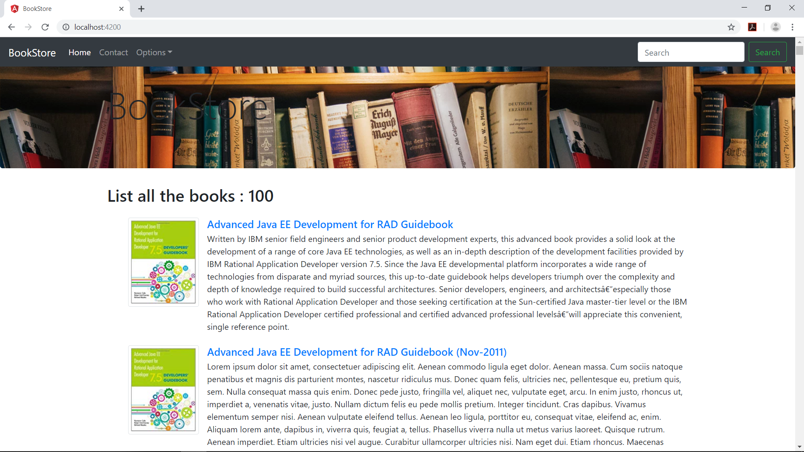
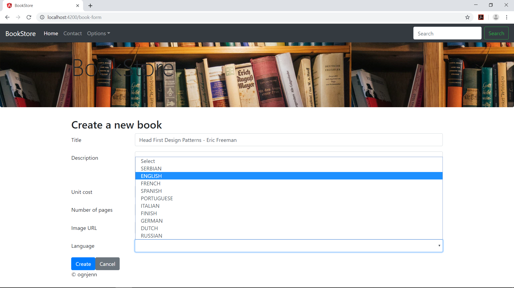
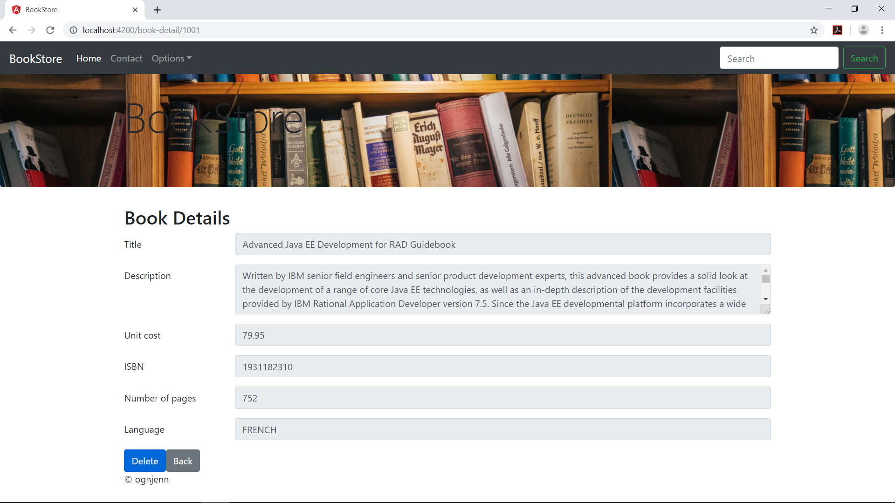

# BookStore

  Structure:
  
 -The BookStore application is divided into a Java EE REST back-end (bookstore-back) and an Angular front-end (bookstore-front).
 
  ScreenShots:
 
                                                bookstore main page
 
 
 
  

  
